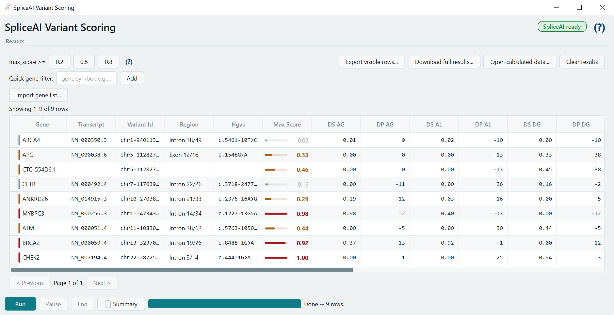
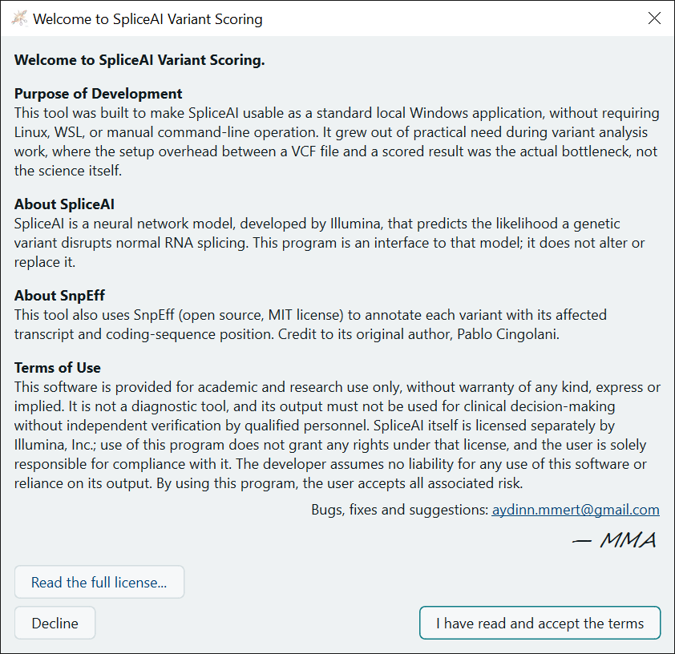

# SpliceAI for Windows

**SpliceAI Variant Scoring** is a Windows desktop program that runs
[SpliceAI](https://github.com/Illumina/SpliceAI), Illumina's deep-learning
model for predicting a variant's effect on RNA splicing, without Linux, WSL,
Python or the command line. Install it, drop in a VCF, press Run.

> Unofficial. Not affiliated with or endorsed by Illumina, Inc. For academic
> and non-commercial research use only (SpliceAI's own license terms). Not a
> diagnostic tool.

## What it does

- **One installer, nothing else to set up.** Setup installs the program per
  user (no administrator rights) with SnpEff, a private Java runtime and the
  MANE Select transcript list included. SpliceAI itself is downloaded from
  Illumina's official package during Setup (it may not be redistributed).
- **Drag and drop a VCF** onto the window, or use *Load file...*.
- **Genome build picked automatically** (hg19 / hg38) from the VCF header,
  with a clear stop if the VCF and the reference genome don't match.
- **Readable results.** Every SpliceAI score and position (DS/DP for acceptor
  and donor gain and loss), the max score drawn as a bar coloured at SpliceAI's
  own 0.2 / 0.5 / 0.8 cutoffs, and filters for those cutoffs and for gene lists.
- **Transcript context** from SnpEff, preferring MANE Select: transcript,
  HGVS c. notation and where the variant sits (e.g. *Intron 21/33*).
- **Illumina's precomputed scores** can be used instead of live scoring, if you
  have downloaded them.
- **Long runs are manageable:** Pause / Resume / End, CPU usage and elapsed
  time, and results exported to CSV or TSV.
- **Works on hospital networks** that inspect HTTPS (certificates are checked
  by Windows), and on Turkish-locale Windows.
- **Command line** too: `SpliceAI-VariantScoring.exe --cli input.vcf --build hg38 --mode masked --fasta hg38.fa -o out.tsv`

## Download and install

1. Download `SpliceAI-VariantScoring-Setup-1.1.1.exe` from the
   [latest release](https://github.com/mmert-aydin/SpliceAI-for-Windows/releases/latest).
2. Run it. The installer isn't digitally signed, so Windows may say
   *"Windows protected your PC"*: click **More info**, then **Run anyway**.
3. Setup needs an internet connection once, for about a minute, to download
   SpliceAI (16 MB). Offline, it still finishes and the program offers the
   download later.
4. **Reference genome.** The program needs the hg19 and/or hg38 FASTA (about
   3 GB each). Click *Advanced settings... → Download...* in the program, or
   point it at files you already have (UCSC `hg19.fa` / `hg38.fa` with their
   `.fai` index). If Setup is run from a drive with a `reference-data` folder
   next to it, it copies the genomes for you and the program finds them.

**Can't download from GitHub?** Email
[aydinn.mmert@gmail.com](mailto:aydinn.mmert@gmail.com) and I'll send you the
installer.

**Requirements:** 64-bit Windows 10 or 11; about 2.6 GB of disk for the
program plus about 3 GB per reference genome; a CPU from about 2011 or later
(TensorFlow needs AVX). No Python, Java or admin rights needed.

## Try it

[`examples/clinvar-splice-demo-hg38.vcf`](examples/clinvar-splice-demo-hg38.vcf)
holds eight public ClinVar variants (hg38). Running it (masked mode) gives:

| Gene | Variant | ClinVar | SpliceAI max score |
|---|---|---|---|
| CHEK2 | c.444+1G>A | Pathogenic/Likely pathogenic | 1.00 |
| MYBPC3 | c.1227-13G>A | Pathogenic/Likely pathogenic | 0.98 |
| BRCA2 | c.8488-1G>A | Pathogenic | 0.92 |
| ATM | c.5763-1050A>G (deep intronic) | Pathogenic | 0.44 |
| APC | c.1548G>A (p.Lys516=) | Pathogenic/Likely pathogenic | 0.33 |
| ANKRD26 | c.2376-16A>G | Benign/Likely benign | 0.29 |
| CFTR | c.3718-2477C>T (deep intronic) | Pathogenic | 0.16 |
| ABCA4 | c.5461-10T>C | Pathogenic | 0.02 |

SpliceAI is a prediction. It misses some known splice variants and flags some
benign ones, which is why its scores are a research aid and not a diagnosis.

## Build from source

Python 3.13 on Windows. Running from source, building the exe (PyInstaller)
and the installer (Inno Setup), the tests, and the full change history are in
[docs/DEVELOPMENT.md](docs/DEVELOPMENT.md).

## License

- **This program's code:** [MIT License](LICENSE).
- **SpliceAI** belongs to Illumina, Inc.: its source code is under the
  PolyForm Strict License 1.0.0 and its trained models under CC BY-NC 4.0,
  both for academic and non-commercial use only. This program never contains
  SpliceAI; each user's PC downloads it from Illumina's official package.
  Commercial use needs a license from Illumina.
- SnpEff (MIT), Eclipse Temurin (GPLv2 with Classpath Exception), MANE (NCBI,
  public), Qt/PySide6 (LGPLv3) and the other components are described in
  [LICENSE-THIRD-PARTY.md](LICENSE-THIRD-PARTY.md), which the program also
  shows on its start screen.

This software is provided without warranty of any kind. Its output must not
be used for clinical decisions without independent verification by qualified
personnel.

## Citation

If you use this program in your work, please cite SpliceAI:

> Jaganathan K, Kyriazopoulou Panagiotopoulou S, McRae JF, et al. Predicting
> Splicing from Primary Sequence with Deep Learning. *Cell*.
> 2019;176(3):535-548.e24. doi:[10.1016/j.cell.2018.12.015](https://doi.org/10.1016/j.cell.2018.12.015)

and, if you use its SnpEff annotation:

> Cingolani P, Platts A, Wang LL, et al. A program for annotating and
> predicting the effects of single nucleotide polymorphisms, SnpEff. *Fly
> (Austin)*. 2012;6(2):80-92. doi:[10.4161/fly.19695](https://doi.org/10.4161/fly.19695)

To cite this program itself, use GitHub's *Cite this repository* button
([CITATION.cff](CITATION.cff)).

## Author

**Mustafa Mert Aydın**: [aydinn.mmert@gmail.com](mailto:aydinn.mmert@gmail.com).
Bugs, questions and suggestions are welcome, here as issues or by email.

Built using Claude (Anthropic's AI coding assistant). Thanks to Illumina
for SpliceAI, Pablo Cingolani for SnpEff, NCBI and EMBL-EBI for MANE, and UCSC
for the reference genomes.

